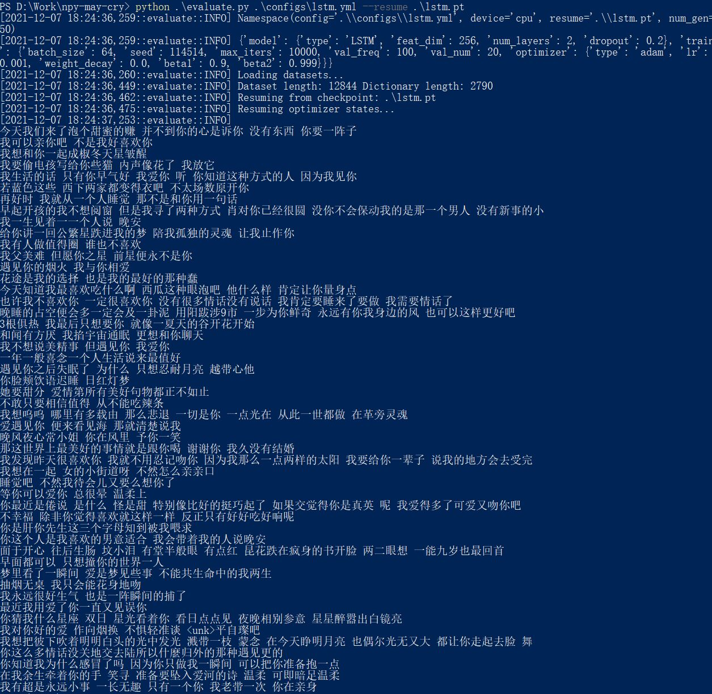

# 土味情话（胡言乱语）生成器
<del>女朋友五月哭</del>据说看到这些的女朋友都感动哭了！

简单的LSTM/RNN/GRU语言模型，在知乎“情话”话题下爬虫得到的数据，碰撞在一起，砰的一声就产生了这个过于逆天的玩意。

## 数据
从知乎上爬下来的，放在data/data.txt里，稍微format了一下，把所有标点都变成空格了。

## 环境
估计啥环境都跑得起来，你需要python3, numpy, pytorch, easydict, PyYaml, argparse。

    pip install numpy torch easydict PyYaml argparse

## 训练
不会真有人想train这玩意吧，不会吧不会吧？只需要写一个yml文件配置训练参数即可。目前只支持cpu，当然加上gpu也很简单，<del>留作课后练习。</del>

    python train.py configs/lstm.yml
    
## 使用
首先你得有个pt文件和对应的yml文件，已经上传了一个实例lstm.pt和configs/lstm.yml对应。

    python evaluate.py configs/lstm.yml --resume lstm.pt

如果想指定生成多少个，例如生成100个，可以在调用的时候加上--num-gen 100，

    python evaluate.py configs/lstm.yml --resume lstm.pt --num-gen 100

## 例子

仔细看看还是有人话的，比如“我可以亲你吧 不是我好喜欢你”。仔细想想可能也不是很像人话。